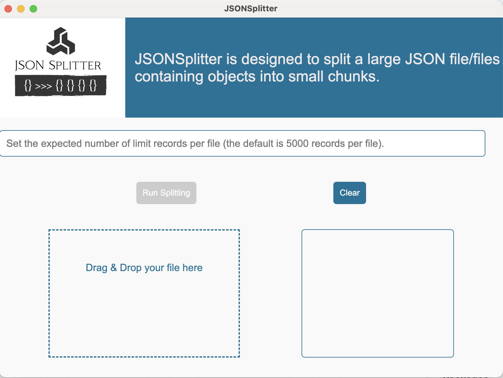

<p align="center">
  <a href="./logo/demo.png">
    <picture>
      
    </picture>    
  </a>
</p>

<p align="center">
  <a href="./CHANGELOG.md">Release Notes / History / Changes</a> 
</p>
<p align="center">
  <a href="./CONTRIBUTING.md">Contributing</a> 
</p>
<p align="center">
  <a href="https://github.com/VadimNastoyashchy/JSONSplitter/issues">Issue Tracker</a> 
</p>
<p align="center" style="font-size:120%;">
  Fast, easy and reliable JSON splitter!
</p>

# Getting started

## 1. Clone the repo / or download latest [Source code (zip)](https://github.com/VadimNastoyashchy/JSONSplitter/releases)

> Before you follow the steps below, make sure you have the

[Node.js](https://nodejs.org/en/download/) installed _globally_ only your system

## 2. Installing (Open the JSONSplitter root directory)

```bash
npm install
```

## 3. Running

```bash
npm run start
```
